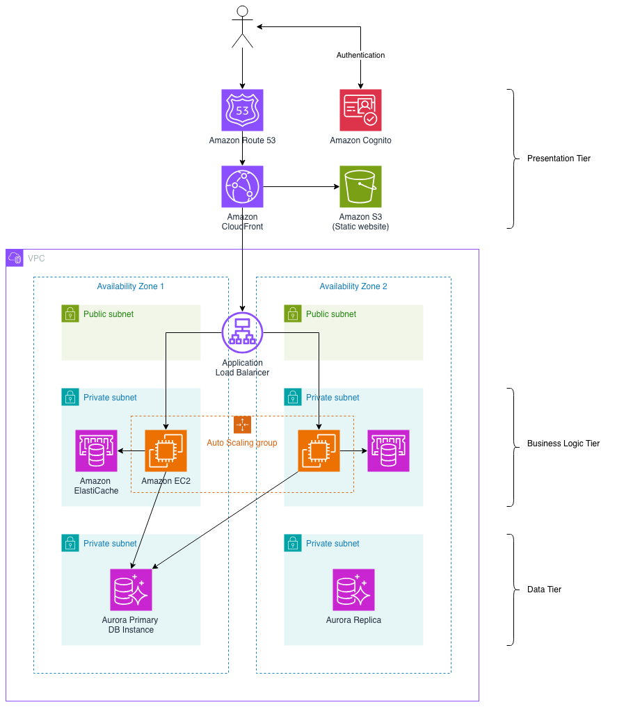

# Multi-Tier High Availability Web Application

**This project is a work-in-progress.**

A highly available 3-tier web application infrastructure built with AWS CDK in Go. I used [Kiro](https://kiro.dev/) to get this off the ground!

## Why this project?

This project simulates the architecture a small organisation might build to modernise a monolithic Go application onto AWS. It's a contrived use case, but I wanted to get some hands-on experience with technologies that are common for this kind of thing since with most of my experience in serverless services like Lambda and DynamoDB.

The actual application is deliberately simple, but the architecture supports the imaginary organisation's desire for:

- Scalability in peak-load periods.
- Improved deployment processes with infrastructure-as-code.
- Avoiding a rewrite of their monolithic application code into Lambdas, with this option open in the future.
- Establishing a pathway for future modernisation and decomposition.
- A managed solution for authentication to reduce overhead.

## Architecture Overview



## Prerequisites

- An **AWS Account** with appropriate permissions
- **AWS CLI** installed and configured (`aws configure`)
- **Node.js** 18+ and npm (for CDK CLI)
- **Go** 1.23.0+ installed
- **AWS CDK CLI** installed globally

# Quickstart

## Setup & deployment

1. Install dependencies:

```bash
go mod download
```

2. Bootstrap CDK (first time only):

```bash
cdk bootstrap aws://<ACCOUNT-ID>/ap-southeast-2
```

3. Create a `.env` file in the root directory, based off `.env.template`, and fill out the values.

4. Synthesize CloudFormation template:

```bash
cdk synth
```

5. Deploy the stack:

```bash
cdk deploy
```

## Deploying the static site

```bash
# Get the bucket name from outputs (WebsiteBucketName)
BUCKET_NAME="<WebsiteBucketName from outputs>"

# Upload website files to S3
aws s3 sync website/ s3://$BUCKET_NAME/ --delete

# Verify upload
aws s3 ls s3://$BUCKET_NAME/
```

After this, you should be able to see the front end by navigating to the `CloudFrontUrl` from outputs.

## Making app server changes

```bash
# Build the app
go build .

# Build the Docker image
docker build -t <AppName> .

# Tag the deployment
docker tag <AppName>:latest <ECRRepositoryUri from outputs>

# Authenticate to ECR
aws ecr get-login-password --region ap-southeast-2 \
  | docker login --username AWS --password-stdin <ACCOUNT_ID>.dkr.ecr.ap-southeast-2.amazonaws.com

# Push the image to ECR
docker push <ECRRepositoryUri from outputs>:latest
```

After this you'll need to perform an instance refresh on the Auto Scaling group to update the instances.

```bash
aws autoscaling start-instance-refresh --auto-scaling-group-name <AutoScalingGroupName from outputs>
```

## Making front end changes

```bash
aws cloudfront create-invalidation --distribution-id <DistributionId> --paths "/*"
```
